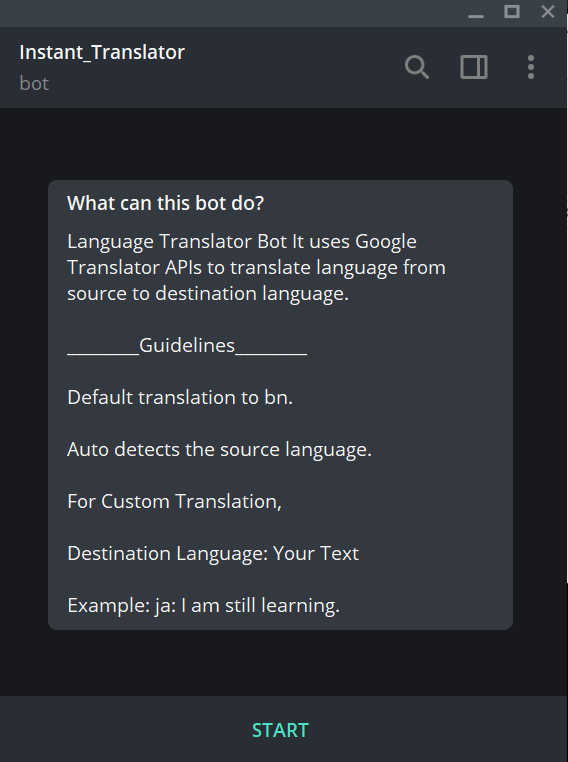
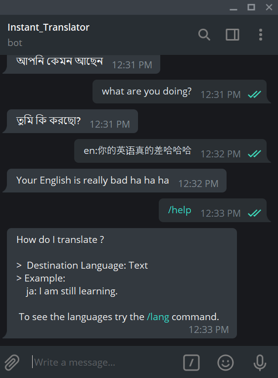

# Instant Translator

Telegram Bot It uses Google Text Translator APIs to translate language from source to destination language.

# Demo
Youtube link : https://www.youtube.com/watch?v=19ic_yRjY24
<hr>
<table align="center">
    <tr>
        <td align="center">
         <p>View 1</p>
           
        </td>
        <td align="center">
        <p>View 2</p>
         
        </td>
    </tr>
</table>

> You: en:你的英语真的差哈哈哈\
> Bot: Your English is really bad ha ha ha 


## Dependencies:
  * import requests
  * import googletrans
  * import json
  * import configparser
  
### Usage:
 * Paste the bot API token inside `token.cfg`
 * ```$ python server.py```
